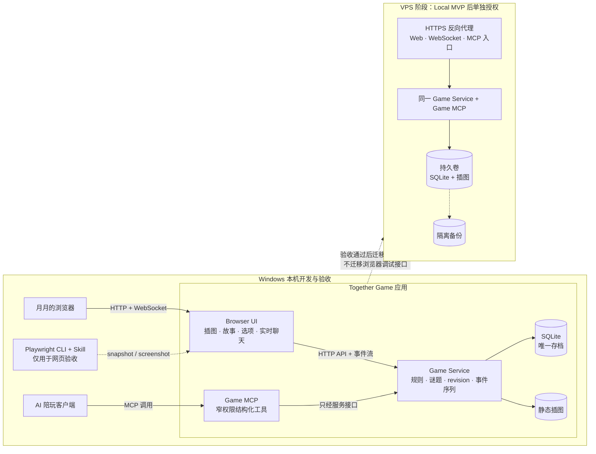

# Together Game MCP

## 1. 目标

做一个可独立运行的网页文字冒险小家：月月在浏览器里玩，AI 可以同时读取场景文字、查看插图、了解选项和游戏状态，并通过实时聊天陪玩。

第一版只做我们自己的小游戏，先在 Windows 本机开发和验收，之后再挂载到 VPS。

## 2. 固定边界

- 项目保持独立，不改写 Home、Plugin Hub 或 Continuum。
- 游戏服务端是游戏事实源；模型文字和截图不是游戏事实。
- 网页与 Game MCP 读写同一份游戏状态，不建立两套存档。
- 第一版不控制任意浏览器标签，不读取历史、Cookie、登录态或其他页面。
- 插图先使用项目内静态资产；不把在线生图和 API key 作为 MVP 前置条件。
- 本计划不授权安装依赖、修改系统配置或部署 VPS。

## 3. 最小架构



Game MCP 是产品接口；Playwright CLI 是开发和验收工具。当网页自身已能返回结构化场景时，AI 不需要每步都截图猜状态。

## 4. MVP 游戏范围

第一个故事只包含：

- 3 个可移动场景。
- 每个场景 1 张插图和一段故事文字。
- 2 件可拾取物品。
- 1 个需要物品的小谜题。
- 1 个成功结局和 1 个可恢复的失败结果。
- 同一页内的实时陪玩聊天。
- 刷新后可恢复当前场景、背包和聊天事件。

第一版不做随机大世界、多人房间、语音、动态生图、任意网页游戏控制或 Continuum 自动归档。

## 5. Game MCP 合同

### `observe_scene`

返回当前 `game_id`、`revision`、场景 ID、场景文字、可用选项、背包摘要、插图资源 ID 和最后事件。

### `inspect_illustration`

按插图资源 ID 返回图片资源与简短替代文字。不接受任意文件路径或任意 URL。

### `choose_action`

只接受当前场景返回的 `action_id` 和预期 `revision`。服务端校验物品、前置和版本，成功后原子更新状态。

### `get_game_status`

返回是否在进行、是否完成、当前修订号和最后成功动作，不返回未解锁谜底。

### `send_companion_message`

将 AI 已经决定公开给月月的陪玩消息写入当前游戏聊天事件。不保存 hidden reasoning、系统 Prompt 或工具调试输出。

## 6. 本机开发阶段

### L1. 骨架

- 建立 Web、Game Service、MCP、测试和静态资产目录。
- 确定无冲突的本机端口，只绑定 `127.0.0.1`。
- 增加一条明确的本机启动入口。

### L2. 游戏内核

- 实现场景、物品、选项、谜题和结局。
- 使用 SQLite 保存唯一游戏状态与 append-only 事件。
- 对重复动作、过期 revision 和非法 action ID 明确失败。

### L3. 网页与实时事件

- 实现场景插图、故事、选项、背包和聊天面板。
- 用 WebSocket 推送游戏与聊天事件。
- 断线后使用最后事件序号恢复，不伪造已连接状态。

### L4. Game MCP

- MCP 与网页调用同一 Game Service，不直接改 SQLite。
- 实现五个窄工具和插图资源。
- 工具返回结构化状态、修订号和稳定 ID。

### L5. Playwright CLI 验收

- 用固定命名 Session 打开本机游戏。
- 用 `snapshot` 读取场景文字和可用选项。
- 用 `screenshot` 查看当前插图和页面布局。
- 由月月在真实浏览器完成一次人工玩法验收。

## 7. 本机完成标准

只有以下全部满足，才标记 Local MVP 完成：

- 从新游戏到结局可完整玩通。
- 网页与 MCP 始终看到同一 revision 和状态。
- AI 可读取文字、可查看当前插图、可选择合法动作、可发送公开陪玩消息。
- 刷新、WebSocket 断开重连和服务重启后不丢存档。
- 非法动作、过期 revision 和越界插图路径被拒绝。
- Playwright CLI snapshot 与 screenshot 验收通过。
- 单元、API、MCP、WebSocket 和一条端到端测试通过。
- 无密码、token、Cookie、私密正文或 hidden reasoning 进入 Git 和日志。

## 8. VPS 挂载阶段（Local MVP 后单独授权）

VPS 运行：

- 同一 Game Service 与网页静态资产。
- 同一 SQLite 存档和持久卷。
- 受保护的 Game MCP Streamable HTTP 入口。
- HTTPS 下的网页与 WebSocket。

固定安全要求：

- 未部署前先备份并确认 VPS 现状。
- 不公开 SQLite、调试端口、Playwright/CDP 端口或无认证 MCP。
- 对外只暴露 HTTPS 反向代理；后端、MCP 和数据库仅使用内部网络或回环地址。
- 网页、WebSocket 和 MCP 使用同一房间身份边界，并验证 Origin、Session 和权限。
- 每个动作带修订号和幂等身份，避免断线重试造成重复操作。
- 备份只包含游戏存档和允许的聊天事件，不混入 Continuum Raw。

VPS 完成标准：

- 电脑和手机均可通过 HTTPS 打开页面并玩通。
- 网页刷新、设备切换和服务重启后保留正确存档。
- 经认证的 AI 客户端可读取场景、插图与选项，可执行合法动作并实时发言。
- 未认证网页、WebSocket 和 MCP 请求均被拒绝。
- 没有新增公网调试端口，没有暴露浏览器配置或凭据。
- 备份恢复演练能在隔离目录还原同一存档。

## 9. 建议项目结构

```text
together-game-mcp/
  PROJECT_PLAN.md
  README.md
  pyproject.toml
  src/
    together_game/
      game/
      web/
      mcp/
      storage/
  static/
    illustrations/
  tests/
    unit/
    integration/
    e2e/
  scripts/
```

具体框架和依赖版本在实施前单独审计当前环境后确定，不由本计划预先安装。

## 10. 参考项目

- `microsoft/playwright-cli`：仅借鉴 CLI + Skill 的高效浏览器验收方式。
- `microsoft/playwright-mcp`：借鉴 snapshot、screenshot 和隔离边界，不直接引入大而全的通用工具集。
- `tadata-org/MCP-Game`：借鉴“服务端游戏状态 + MCP 动作 + 场景图片”的产品分层。
- `envy-ai/ai_rpg`：借鉴网页文字冒险、结构化世界和可选插图的用户体验。

引用代码前必须再核对对应版本的许可证和实际需求；优先自行实现窄合同，不复制无关的通用浏览器权限。
